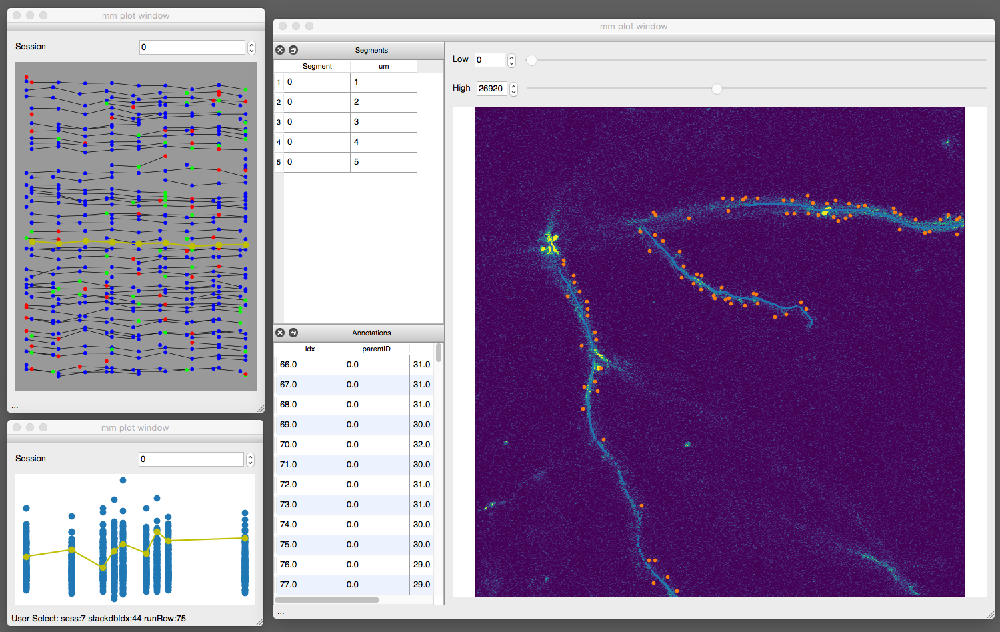
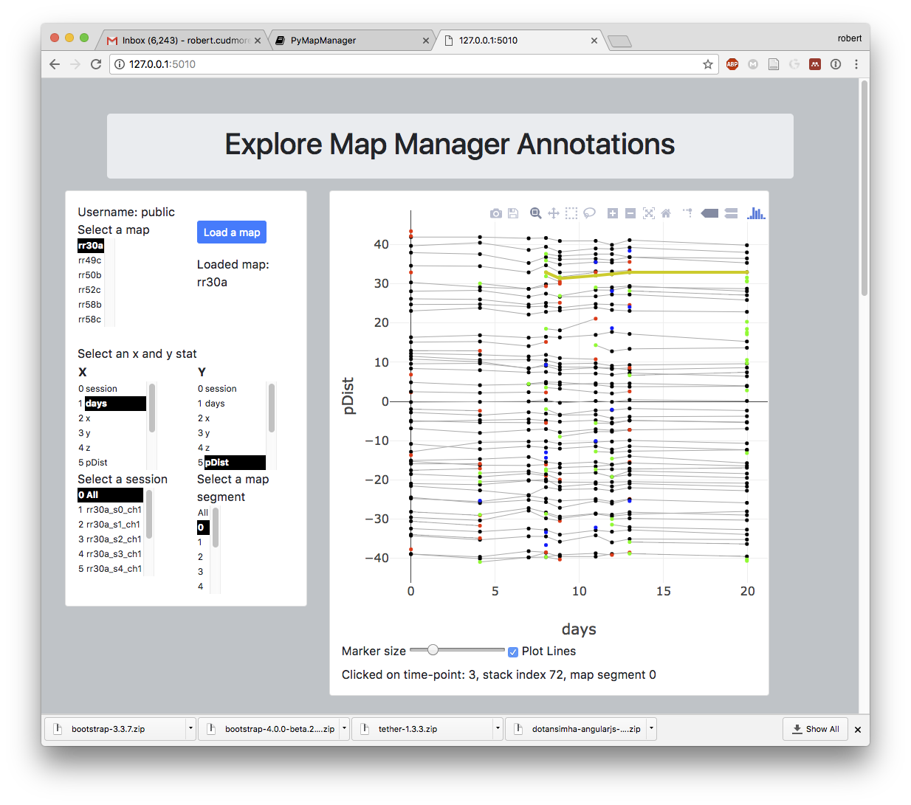
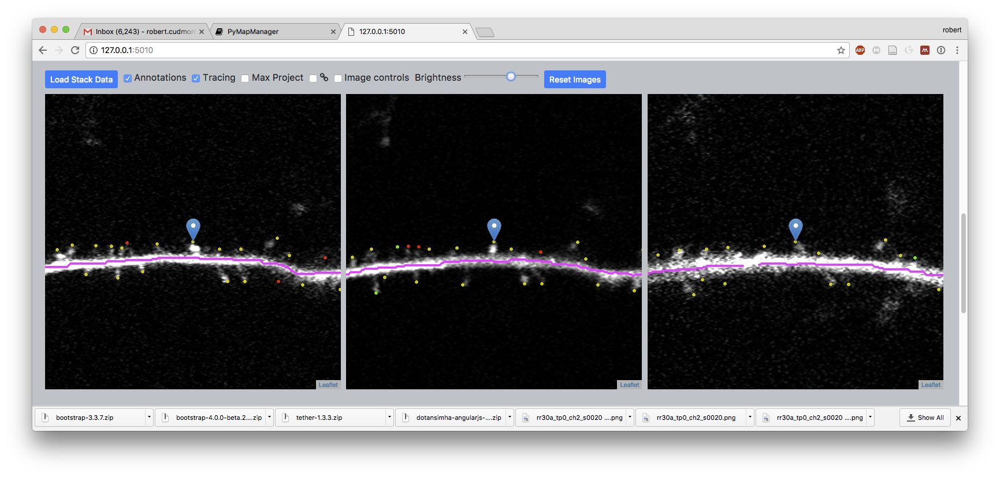
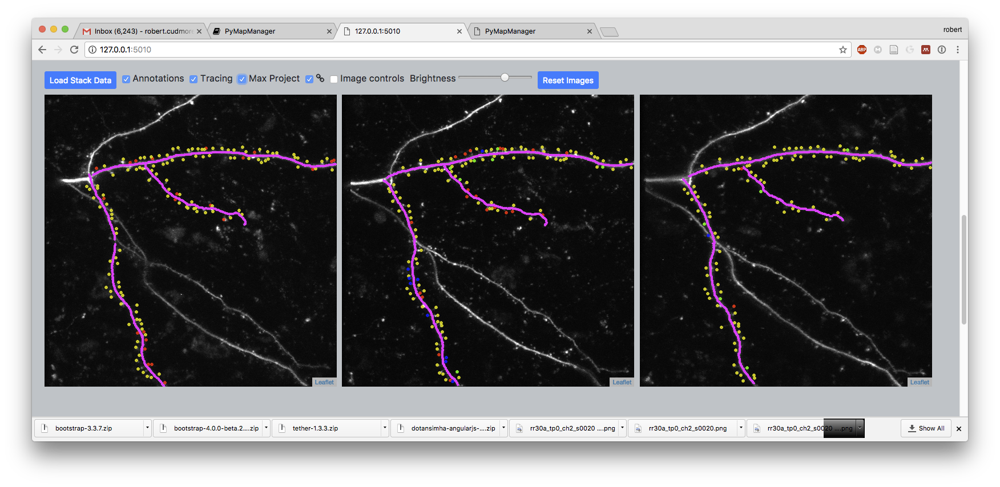

[](https://badge.fury.io/py/pymapmanager)
[](https://github.com/mapmanager/PyMapManager/actions)
[](https://codecov.io/gh/mapmanager/PyMapManager)
<BR>
[]()
[](https://www.python.org/downloads/release/python-3111/)
[](https://github.com/cudmore/mapmanager/blob/master/LICENSE)


PyMapManager is an ecosystem of tools to load and visualize time-series annotations and 3D image volumes. For a complete overview, see the main [PyMapManager](https://mapmanager.net/PyMapManager/) documentation.

**Note:** This code is under active development and is not ready for general use. Check back later and we will eventually have a working version.

<BR>

PyMapManager has a modular architecture with the following components:

 - Backend API is in [MapManagerCore](https://github.com/mapmanager/MapManagerCore)
 - Frontend desktop GUI (this repo)
 - Frontend web interface [WebMapManager](https://github.com/mapmanager/WebMapManager)

## Install

Create and activate a conda virtual environment

```
conda create -y -n pmm-env python=3.11
conda activate pmm-env
```

Clone the GitHub repository

```
git clone git@github.com:mapmanager/PyMapManager.git
cd PyMapManager
```

Install from source

```
pip install -e .
```

If you are using the `zsh` shell, you need to install using quotes (") like

```
pip install -e ".[gui]"
```

## Run

We are still in the early stages of development.

Make sure you have the `PyMapManager-Data` folder in the same folder as `PyMapManager`.

```
python sandbox/runStackWidget.py
```

## Desktop Application

The next generation desktop application version of Map Manager. Written in Python using the Qt interface library and using the PyMapManager Python package as an back-end.



This screen shot shows the main PyQt interface with a map plot (top left), an annotation plot (bottom left), and an image stack window (right).

~~This project will be merged with <A HREF="https://github.com/cmicek1/TiffViewer">PyQt TiffViewer</A> created by <A HREF="https://github.com/cmicek1">Chris Micek</A>. The PyQt GUI interface is in [PyQtMapManager/](PyQtMapManager/)~~


See the [examples/](examples/) folder for Jupyter notebooks with more examples.

Please see the <A HREF="http://pymapmanager.readthedocs.io/en/latest/">API Documentation</A> and a backup copy <A HREF="http://robertcudmore.org/mapmanager/PyMapManager/docs/">here</A>.


## Map Manager web server

A web server to browse and share Map Manager annotations and time-series images. In addition to the point-and-click interface, there is also a [REST API][rest-api] to programmatically retrieve data.

Running the server is easy with either Python or Docker, see the [server installation](http://cudmore.github.io/PyMapManager/install-server/) for more information.

### Web GUI

The server includes web based browsing and plotting of Map Manager annotations.



... and browsing of 3D image volume time-series with annotations.





[redis]: https://redis.io/
[rest-api]: http://cudmore.github.io/PyMapManager/rest-api/
